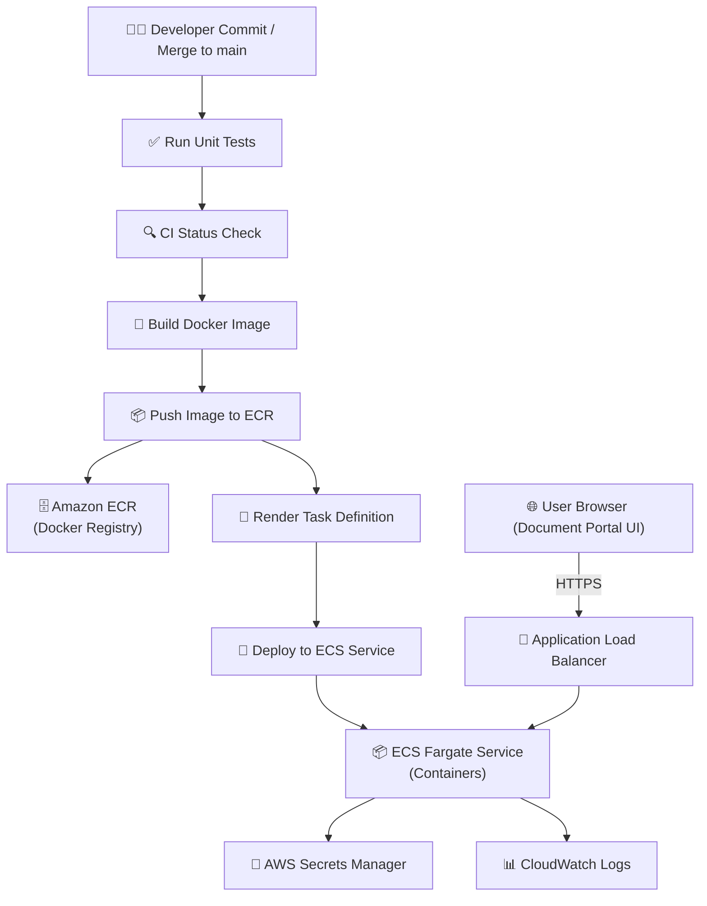

# 📑 Enterprise Document Portal  

An **AI-powered enterprise document portal** that enables:  
- 📄 **Document Summarization**  
- 📑 **Comparison** between multiple documents  
- 💬 **Multi-Document Chat (RAG)** with LangChain  
- ☁️ **Cloud-Native Deployment** on AWS (Docker + ECS Fargate)  
- 🔄 **CI/CD via GitHub Actions** with monitoring and secure secrets management  

---

## 🚀 Features
- Upload and analyze documents (PDF/DOCX).  
- Generate AI-powered summaries.  
- Compare two or more documents for differences.  
- Chat with multiple documents using RAG + embeddings.  
- CI/CD pipeline with GitHub Actions → AWS ECS Fargate.  
- Logs in CloudWatch, secrets in AWS Secrets Manager.  

---

## 🛠️ Project Setup Guide  

```bash
# Create a new project folder
mkdir <project_folder_name>
cd <project_folder_name>

# Open in VS Code
code .

# Create a new Conda environment with Python 3.10
conda create -p <env_name> python=3.10 -y

# Activate environment
conda activate <path_of_the_env>

# Install dependencies
pip install -r requirements.txt

# Initialize Git
git init
git add .
git commit -m "Initial commit"

# Push to remote (after adding remote origin)
git push

# Clone repository
git clone https://github.com/Santoshkumarpuppala/document_portal

```

## 2. Minimum Requirements

### LLM Models

*   Groq (Free)
*   Gemini


### Embedding Models

*   OpenAI
*   Hugging Face
*   Gemini

### Vector Databases

*   In-Memory
*   On-Disk
*   Cloud-Based

## 3. API Keys Setup

### GROQ

*   [Get your API Key](https://console.groq.com/keys)
*   [Groq Documentation](https://console.groq.com/docs/api)

### Gemini

*   [Get your API Key](https://makersuite.google.com/app/apikey)
*   [Gemini Documentation](https://ai.google.dev/docs)

### OpenAI / Claude / Hugging Face

*   Store all keys securely in `.env` or AWS Secrets Manager.

## ⚙️ Deployment Workflow

### CI/CD Pipeline

*   GitHub Actions builds & pushes Docker images → Amazon ECR.
*   ECS Fargate updates tasks using `task-definition.json`.

### AWS Components

*   ECS Fargate (App + Workers).
*   Amazon ECR (container registry).
*   Secrets Manager (credentials, API keys).
*   CloudWatch (logs & monitoring).
*   ALB (Application Load Balancer).

## 📊 Architecture Diagram

You can either embed the Mermaid diagram or add an image.

### Option 1: Mermaid (renders directly in GitHub/Obsidian)


## 🎥 Execution Flow Recording

A full screen recording of the execution flow (uploading docs, analysis, comparison, and multi-doc chat) is available:

👉 [Watch the Demo Video](./assets/execution_flow.mp4)

(If hosted on YouTube or Loom, replace with the public link.)

